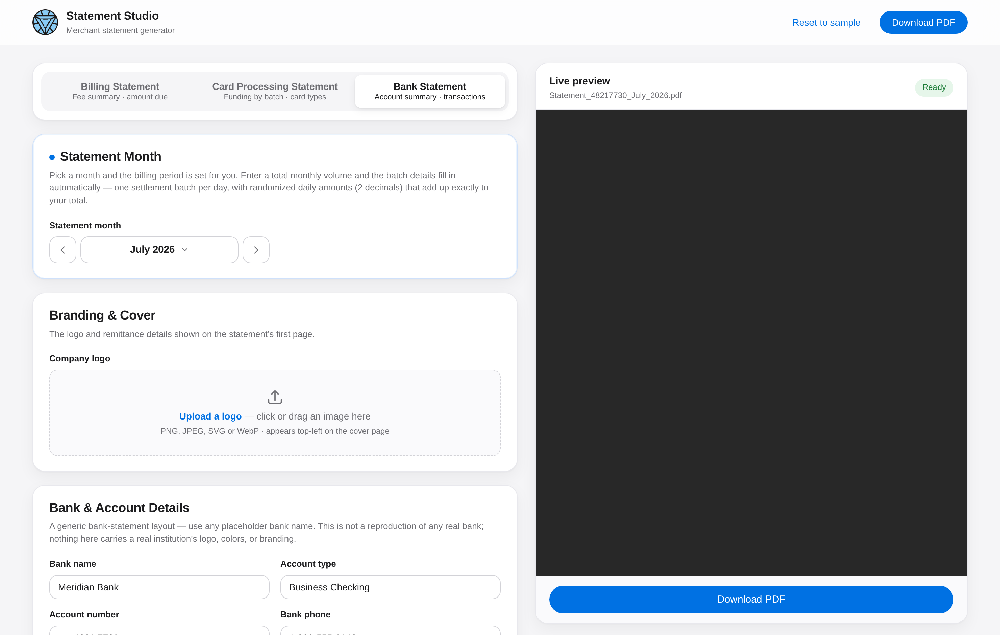

# Statement Studio — Merchant Statement Generator

A self-contained, static web tool that generates merchant statements as
pixel-accurate PDFs in two switchable styles, both reverse-engineered from
reference processor statements and reproduced to sub-point precision — every
rule, column edge and baseline lands where the originals put them (verified
automatically, see **Verification**):

- **Billing Statement** — fee-category summary, totals with amount due,
  batch details (`docs/template-spec.md`, `js/statement.js`)
- **Card Processing Statement** — CMYK-banded funding-by-batch table,
  per-card-type summaries, grouped fee schedule, tax reportable sales,
  including the print-house artifacts (IMb barcode, OMR marks, control
  codes) (`docs/template2-spec.md`, `js/statement2.js`)



## Using it

Open `index.html` — directly from disk or from any static host:

```bash
python3 -m http.server 8000     # then visit http://localhost:8000
```

Everything runs in the browser; no server, build step, or network access is
required, and no statement data ever leaves the page. The form autosaves to
`localStorage`.

- **Branding & Cover** — upload a logo (PNG/JPEG/SVG/WebP; it is normalized to
  PNG and drawn contain-fit in the cover's logo box), plus the remittance
  address and the bold cover notice.
- **Merchant / Details** — the Bill to block and the Details panel
  (statement number, issue date, payment terms, billing ID, billing account
  number, product ID).
- **Billing Period & Summary** — period dates; Total Sales / Transaction Count
  compute automatically from the batch rows (falling back to the Transaction
  Fees items when no batches are entered), with a switch for manual entry.
- **Fees** — five categories matching the reference template (Transaction,
  Card Network, Other Processing, Third Party, Recurring). Line-item amounts
  auto-calculate from Volume × Rate(%) or Fee × Count as you type — enter an
  amount to override, clear it to return to auto. Category totals, the
  subtotal, tax and Amount Due recalculate live and flow into the PDF from
  the same arithmetic. A category that is toggled off is left off the
  statement entirely; an included category with no rows prints with a 0.00
  total, exactly like the originals. Empty cells print as `--`.
- **Tax & Collection** — tax rate and “fees collected”; a non-zero collected
  amount switches the totals block to the `Amount Total / Fees Collected /
  Amount Due` layout with the collected amount shown as `$(…)`.
- **Batch Details** — daily settlement batches with computed net columns; the
  section is omitted when empty.
- **Live preview** — the PDF regenerates as you type; download uses the
  `Statement_<account>_<Month>_<Year>.pdf` naming convention.
- **Import a statement** — drop a previously generated statement PDF (either
  merchant style) and every value on it lands in the matching form fields,
  fully editable. The parser (`js/importer.js`, pdf.js) reads text
  positionally against the measured template geometry, detects the style
  automatically, and round-trips the references: importing the April billing
  statement and regenerating reproduces it with **zero** differences.
  Changing the month after an import re-dates the batch rows into the new
  month while keeping every figure, and the PDF follows.
- **Bank Statement** (`js/statement3.js`) — a third, **generic** template: the
  common structure of a bank statement (masthead, account-summary box,
  Deposits & Credits / Withdrawals & Debits / Checks Paid tables, computed
  daily-balance summary) in a neutral house style. It is **not** a
  reproduction of any real bank — no real logo, brand colors, or trade dress;
  the bank name and details are placeholder fields. Totals and the ending
  balance are computed from the transactions; the month picker sets the
  statement period.

## Layout fidelity

`docs/template-spec.md` documents the measured geometry: page metrics, the
14.25pt line rhythm, exact column edges for every table, rule weights and
colors, wrapping and pagination behavior. `js/statement.js` implements it with
pdf-lib, including details like:

- kerned text runs (pdf-lib draws unkerned by default; the engine splits runs
  at kerning adjustments so glyphs land where the reference renderer put them)
- hyphen-aware line breaking in the uppercase notices block
- the reference's quirk of stacking Details values independently of label
  wrapping, and clipping over-long values at the body edge
- per-column rule segments in the fee/batch tables

One deliberate improvement: section headers are kept together with their
content instead of being orphaned at a page break (the originals occasionally
do this).

## Verification

```bash
node test/generate.js april        # billing statement reference
python3 test/compare.py <reference.pdf> test/out/april.pdf
node test/generate.js style2-july  # card processing statement reference
python3 test/compare2.py <reference.pdf> test/out/style2-july.pdf
```

The comparers (require `pip install pdfplumber`) extract every word, rule and
band from both PDFs and diff text, position (±0.8pt), width, stroke color and
font style. The April billing reference reproduces with **zero** differences;
the May reference matches except for the documented keep-together pagination
improvement. The July card-processing reference matches except for a 1-cent
inconsistency inside the reference itself (its printed grand fee total drops a
cent that its own rows carry; this tool sums consistently).

## Repository layout

| Path | Purpose |
|---|---|
| `index.html`, `css/`, `js/app.js` | the web UI |
| `js/statement.js`, `js/statement2.js`, `js/statement3.js` | the three PDF layout engines (billing, card processing, generic bank) |
| `js/importer.js` | positional statement parser for the import card |
| `js/fonts.data.js` | base64 fonts so `file://` works (regen: `node tools/embed-fonts.js`) |
| `js/brand.data.js`, `assets/` | site brand mark (regen: `node tools/embed-brand.js`) |
| `fonts/` | DejaVu Sans (billing) + Liberation Sans (processing, Arial-metric) |
| `vendor/` | pdf-lib 1.17.1, @pdf-lib/fontkit 1.1.1, pdf.js 3.11.174 (vendored, no CDN) |
| `docs/template-spec.md`, `docs/template2-spec.md` | measured template geometry |
| `test/` | headless generators, coordinate diff harness, import round-trip |

DejaVu fonts are redistributed under their permissive license
(Bitstream Vera / Arev derivative); see `fonts/LICENSE`.
